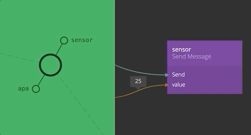

# Send Message
_Send Message_ nodes are used to send a message over MQTT, for example to another device. All devices that connect to the editor will
use the same MQTT broker and thus messages can be sent across devices. The _Send Message_ node uses topics to specify which receivers should get
the messages.

!> Send Message is part of the MQTT module which need to be added to your project before it becomes available. Also note that you have to configure an MQTT broker for it to work. See [MQTT Guide](guides/mqtt.md)

## INPUTS

### GENERAL

**Topic**  
The MQTT topic this _Send Message_ will publish messages to. Most commonly
the topics are specified as a hierarchy with **/** as delimiters, e.g. _/Foo/Bar/1_. Sometimes the topic need to be dynamic, this can be
achieved by encapuslating a topic component with bracets, e.g. _/Foo/{Bar}/1_ , in this case a port called _Bar_ will show up.

**Format**
This input sets in which format the payload will be sent, either JSON or as a CSV.

**Send on Change**
This boolean controls whether a new message will be sent automatically when any payload input change, or if you have to explicitly pulse the *Send* signal to send the message.

**Send**  
This is a signal port and when triggered the corresponding _Receive Message_ nodes will be triggered as well.

### PAYLOAD
_Send Message_ nodes can have arbitrary input ports that represent the payload that will be sent with the message  when the _Send_ signal is triggered. These ports can be added by inspecting the node and clicking the _Add port_ button in the _Payload_ section.

### RATE LIMIT
**Rate Limit**
This boolean specifies if there should be a rate limit added to the messages, i.e. if the number of messages should be throttled at a specific value. This could be useful if you have a continouos stream of messages you want to send, for example a sensor reading, but you want to avoid congesting the MQTT broker.

**Messages / Sec**
If *Rate Limit* is set, this defines how many messages per second this node will send.

## OUTPUTS
This node doesn't have any outputs.

[0]: ./receive-message
