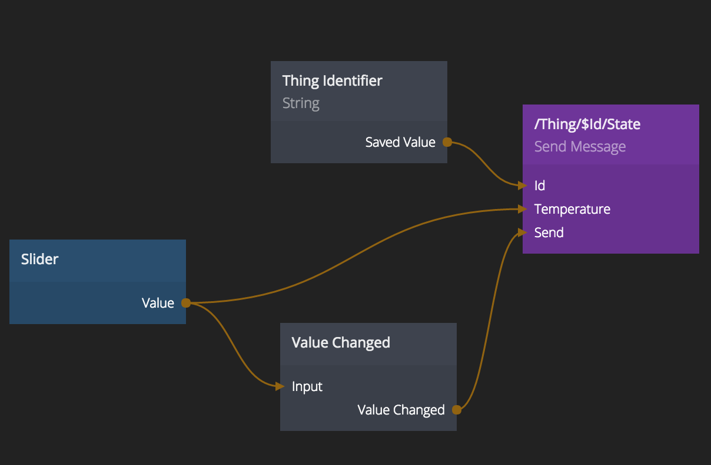

# Send Message
_Send Message_ nodes are used to send a signal to another device or another place in your design. All devices that connect to the editor will
use the same message broker and thus messages can be sent across devices. The _Send Message_ node uses topics to specify which receivers should get
the messages.

_Event Sender_ nodes uses a similar pattern but events are only sent within the current device. They also use a
somewhat simpler concept of channels instead of topics.

## INPUTS
_Send Message_ nodes can have arbitrary input ports that will be passed on to the
[Receive Message][0] nodes when the _Send_ signal is triggered. These ports can be added by
inspecting the node and clicking the _Add port_ button in the _Payload_ section. The [Receive Message][0] nodes
must add ports with corresponding names.

**Topic**  
The topic name can be any identifier and is used on the _Send Message_ nodes to connect a sender and receiver node. Most commonly
the topics are specified as a hierarchy with **/** as delimiters, e.g. _/Foo/Bar/1_. Sometimes the topic need to be dynamic, this can be
achieved by encapuslating a topic component with bracets, e.g. _/Foo/{Bar}/1_ , in this case a port called _Bar_ will show up.

**Send**  
This is a signal port and when triggered the corresponding _Receive Message_ nodes will be triggered as well.

## OUTPUTS
This node doesn't have any outputs.

[0]: ./receive-message
