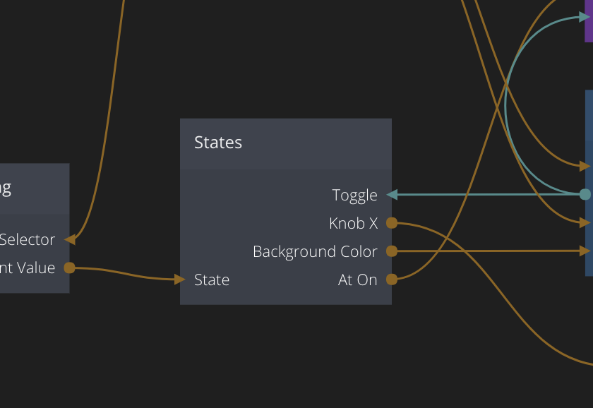

# States
Animate properties by jumping between different states.

## INPUTS
**States**  
A state node can have as many states as is necessary. Add a new state by clicking on the plus button.

**Values**  
Every state will have its own set of values. All values need to be set for every state that is added.

**Toggle**  
Will animate to the next state, or the first state if the current state is the last one.

**Current State**
Set the current state with a string

## Inputs for every state
Every state has its own set of inputs
### State values  
All values in a state has an input. Connect a number to set the values for a state.

### State transition
**Easing Curve**
Selects the curvature of the state animation.

**Duration**  
The duration of the state animation. How long it takes in milliseconds to go from the previous state to this state.

## OUTPUTS
### Current State
**Current State**  
The name of the current state

**State Changed**  
A signal that is sent when the current state is changed

**Values**  
All of the values for the current state

**At "State X"**  
True when the current selected state is X

**Has Reached "State X"**  
Signal that is being sent when the state animation to state X is complete

